# PM_18 / BM_18 : Data Science and AI for Product Managers

**Portfolio Hand-In · SS26**
**Jean-Luc Andre Navarro**
**Module: PM_18 / BM_18 : Data Science and AI for Product Managers**
**Organiser: Florian Grote**
**Submission date: 2026-05-04**

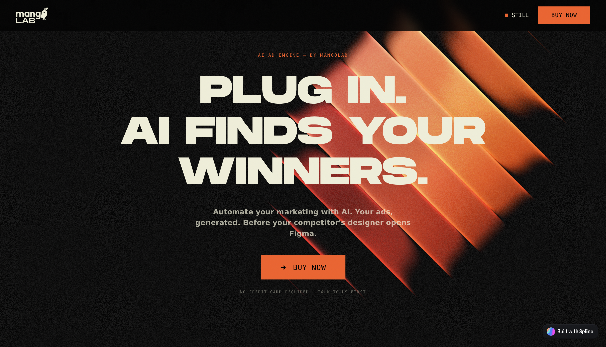

---

## Statement on the use of generative AI in this hand-in

I used Claude (Anthropic) as a writing partner across this portfolio. The structure, the running example (Still + Mango Lab), the eight question answers, and every reflection are my own thinking. Claude helped me organise the document, surface specific numbers I had logged elsewhere, audit the draft for voice consistency, and convert markdown to a clean Word document for final review. Every claim about Still, Mango Lab, the pipeline architecture, the campaign metrics, and the ethics workshop is my own and has been verified against my repo (Nano Bannana wraper) and my campaign data before being included. No paragraph in this document was copied from a model output without rewriting it in my voice and removing anything I had not personally done.

The runnable LLM prompt in Appendix A is a real production prompt from my pipeline, not a Claude-written sample.

---

## How to read this hand-in

I run Mango Lab, an AI marketing agency in Berlin. Inside Mango Lab, I built **Still**, an AI ad-creative engine. Still takes a brand profile, takes a brief, and outputs Meta-ready ad creatives in the brand's voice and visual system. The repo is called Nano Bannana wraper because the first working version wrapped two image models (gpt-image-1 for layout, nano-banana-2 for refinement) into a single pipeline.

Still is the running example for all eight questions. Where the question is about chat-based tools, I use my own Claude and Cursor habits inside Mango Lab ops. Where the question is about data culture, I use the telemetry and campaign data Still and Mango Lab actually log. Where the question is about AI-enabled products, I use Still itself.

Every section follows the same shape: a description of what I do (does not count toward the 2,000 word reflection cap), an applied artefact, then a short reflection on value creation potential and risks (this counts).

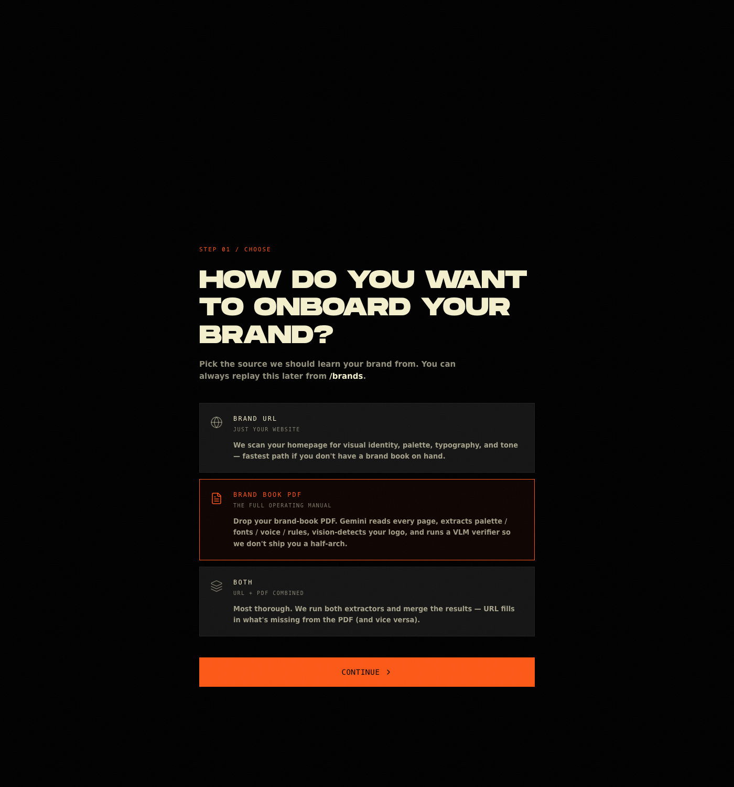

*The onboarding flow above is where Still meets a new customer. The customer picks how they want their brand learned (URL scrape, brand-book PDF parse, or manual extractor). This is the first place AI removes a step that used to require an intake call with a designer.*

---

# Part 1 : Chat-based tools for Product Management

## Q1 · How do I get the most out of LLMs for my specific use case?

**What I do.** My specific use case is high-volume creative generation with brand consistency. The standard "write me an ad" prompt is useless for that. So I split the work into two prompts that do different jobs.

The first prompt locks **layout, typography, hierarchy, and exact text placement**. It reads like a layout designer's brief, not a copywriter's. It tells the model where the headline goes, what weight, what colour, what point size, where the CTA pill sits, what the negative space looks like. The second prompt is shorter and reads like a director-of-photography brief: lighting, materials, depth of field, what to preserve from the first prompt, and a long anti-drift list of things the model is not allowed to change. I learned the hard way that one combined prompt produces drifted layout, missing CTAs, or a CTA pill that looks correct but says "Lear more". Splitting fixed that.

**Applied artefact.** The four reference style anchors I attach as `image_inputs` so the model holds composition and lighting energy across generations:

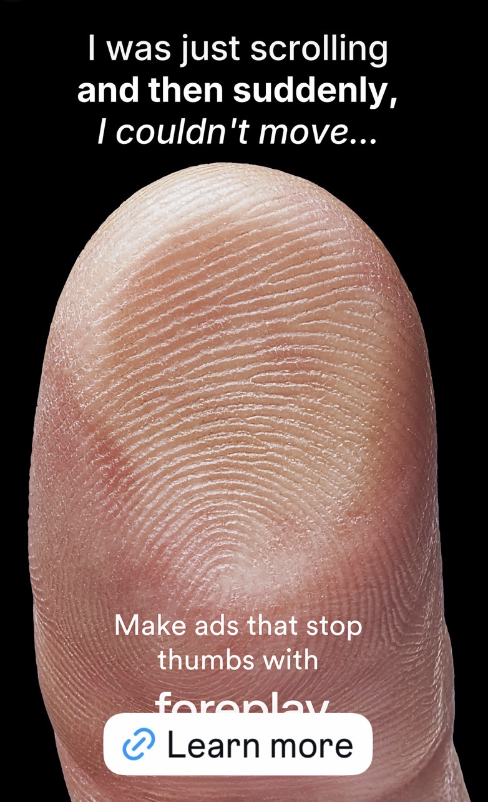

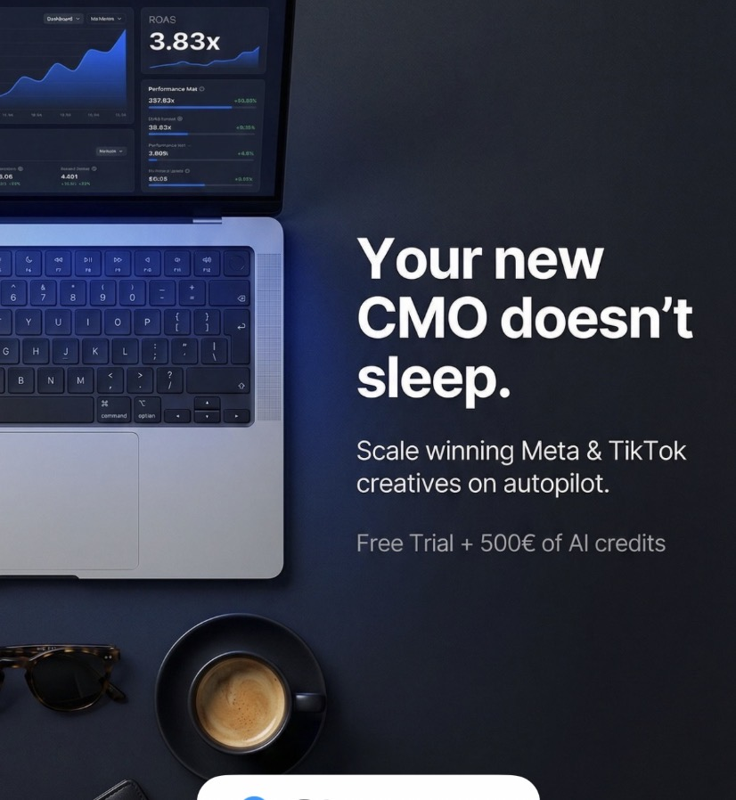

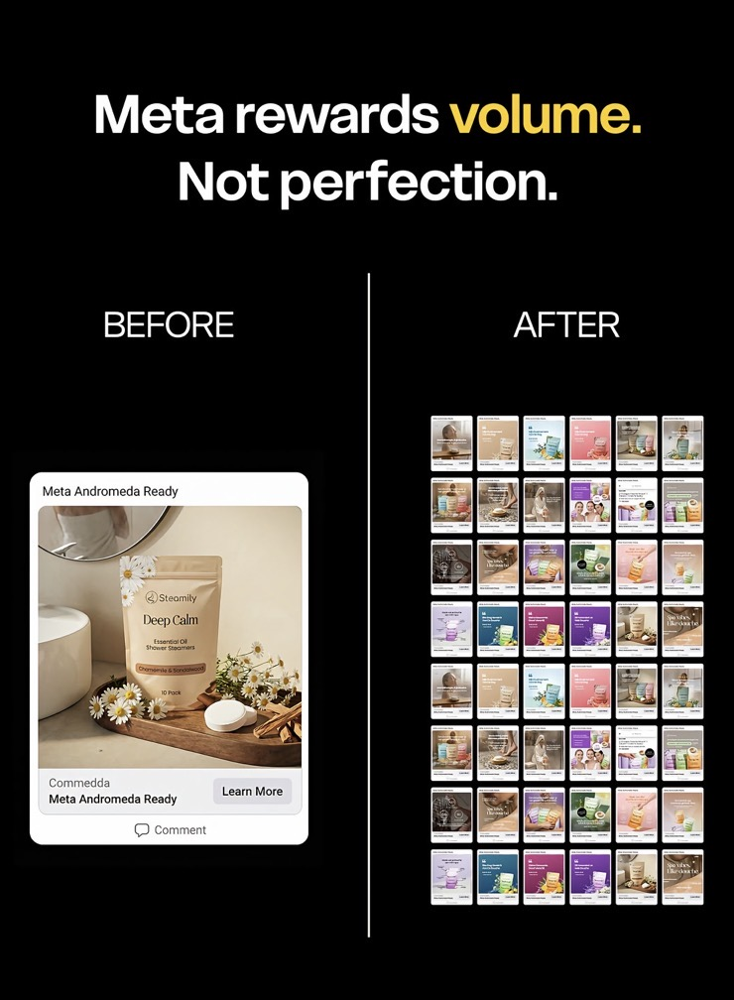

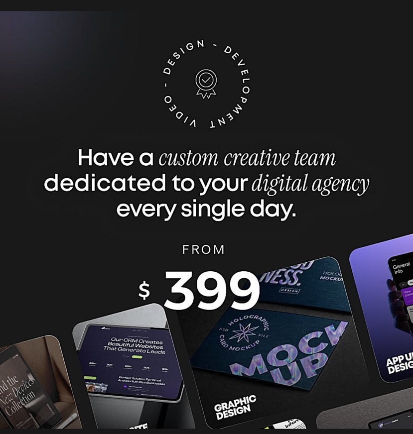

The Stage A prompt for Ad 1 of the Mango Lab campaign (full version in Appendix A) is the load-bearing artefact. Key features I rely on for quality:

- explicit anti-rules ("NO navy. NO gradients. NO pure white.")
- type-pairing rule stated as a hard constraint, not a suggestion
- read-order list at the end ("1) thumb macro, 2) headline top, 3) sub bottom, 4) CTA, 5) wordmark")
- reference image inputs for brand assets, not described in text
- exact font-size targets (~58pt, ~26pt) which the model treats as visual hierarchy cues even if it cannot match the absolute pixel value

**Reflection on value and risks.** The thing the framework changed is that I stopped writing one prompt. I had a Claude project saved with a single 600-word "create a Mango Lab Meta ad" prompt for about three weeks. Outputs were 60% on brand and 40% drifted, and I was rerunning generations until one looked good. The split-prompt structure (layout first, refinement second) cut my reroll rate from roughly 4 attempts per ad to roughly 1.3, which is the difference between Still being a real pipeline and Still being me sitting in front of a generation queue at 1am. The risk side is that this kind of two-stage prompting is brittle to model updates. When OpenAI shipped GPT image 2 with stronger text rendering, I had to re-tune Stage A because it was now strong enough at typography to skip the second pass for some compositions. So the pipeline I built around weakness number one is going to keep breaking as the weakness goes away, which is an expensive reality of building on top of fast-moving models.

---

## Q2 · How do I make use of LLM-based tools in my product operations environment?

**What I do.** Three places, every working day.

1. **Claude (chat + Claude Code in the terminal)** is where I run Mango Lab ops: drafting briefs, turning client calls into structured campaign documents, building the Still repo, debugging the pipeline. I keep a memory file system per project so Claude does not start cold every conversation. The CODE Modules project alone has six memory files (user profile, voice rules, project status, dashboard setup, hand-in quality bar, beachhead).
2. **Claude inside the Still pipeline** as the upstream brief synthesiser. The pipeline architecture (documented in `Generation_Pipeline_Brief.md`) calls Claude Haiku to turn raw brand fields and a brief into a structured retrieval brief, then Claude Sonnet to expand the brief into a concrete creative concept before any image model touches it. The reason for two Claude steps is cost and latency: Haiku is roughly $0.001 per call and good enough for the structured-output step, Sonnet is more expensive and gets the creative-concept step where reasoning quality matters.
3. **Cursor with Claude Sonnet** as the everyday IDE. Cursor is where the pipeline code, the dashboard, the prompts, and most of the writing actually live.

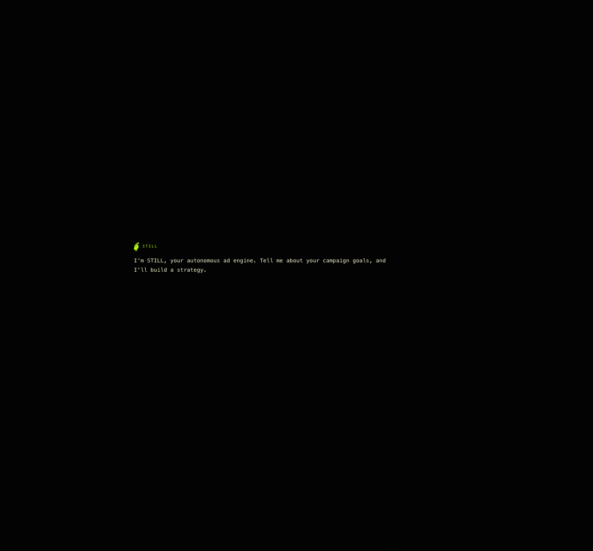

**Applied artefact.** The pipeline cost and latency table from `Generation_Pipeline_Brief.md`:

| Stage | Model | Latency | Cost |
|---|---|---|---|
| Brief synth | Claude Haiku | ~2s | ~$0.001 |
| Concept expansion | Claude Sonnet | ~6s | ~$0.02 |
| Layout (Stage A) | gpt-image-1 high | ~30–60s | ~$0.12 |
| Refinement (Stage B) | nano-banana-2 4K | ~60–90s | ~$0.04 |
| **Per ad** | | **~90–150s** | **~$0.16** |

Five ads end-to-end is roughly $0.80 and roughly 7–10 minutes if I run the stages in parallel.

**Reflection on value and risks.** What I noticed is that "use an LLM for ops" is not a single thing. Routing matters more than which model. I waste money if I send a structured-extraction job to Sonnet when Haiku does it for one tenth the cost; I waste output quality if I send a creative-reasoning step to Haiku when Sonnet does it properly. The risk side is that this routing decision rots faster than I expect. Three months ago Haiku could not reliably extract structured fields from messy creative briefs and I had to use Sonnet for everything. Today Haiku is good enough for that step. So my pipeline routing is right today and will probably be wrong by August, which means I am committing to a maintenance tax I have not actually budgeted for.

---

# Part 2 : Data Culture

## Q3 · What are the components of my data infrastructure in Still?

**What I do.** Still is small enough that the data infrastructure is honest. Five components.

1. **Brand inputs** sit as files in the repo (`Assets/mango_wordmark.png`, `Assets/mango_mascot.png`, four reference ads as `ref_*.jpg`). For Mango Lab itself this is fine; for a multi-tenant version I will need to lift these into Supabase or S3 with per-tenant scoping.
2. **Prompts as data** live as JSON (`mango_prompts.json`, `mango_prompts_full_brief_backup.json`) so I can version them, diff them, and hand them off between agents. Prompts are products in this pipeline; treating them as code (with a backup copy of the full brief preserved separately) is the closest I have to a prompt registry.
3. **Generation telemetry** writes to `debug_daily.log`. Every run logs token counts, output length, and cost. The most recent log line shows a single agent session that consumed roughly 67 million tokens across 604 turns at a real spend of $50.67. That number is what tells me whether a pipeline change is actually paying for itself.
4. **Outputs** land in `Generated/` with a strict naming convention (`adN-stageA.png`, `adN-final.png`). Naming is the cheapest version control I have for a stateless image generation step.
5. **Campaign performance data** lives in Meta Ads Manager. There is no Meta integration in Still yet. We still upload every creative manually and pull the numbers back manually too. For the Mango Lab campaign the numbers are: $143 spent, 42,958 impressions, 200+ leads, in less than a month.

**Applied artefact.** The Still dashboard, which is where these five components surface as a single view of campaign + pipeline state:

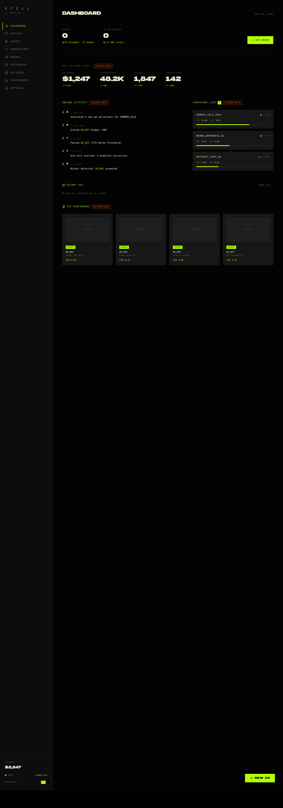

The repo tree behind it: `HANDOFF_BRIEF.md`, `Creative_Brief.md`, `Mango_Lab_Ad_Copy.md`, `mango_prompts.json`, `Assets/`, `Generated/`, `debug_daily.log`. Six artefacts, four of which are the data infrastructure.

**Reflection on value and risks.** Building Still as a flat-file repo with JSON prompts and a markdown handoff brief was the right call for a single-operator pipeline. It let me iterate at the speed of a text editor, not at the speed of a database migration. The risk is that the moment I add a second user (Alberto, my co-founder, or the first paying client), this infrastructure stops being honest. JSON in a repo cannot enforce per-tenant isolation. A debug log in a repo cannot answer "what did I generate for client X last Tuesday". I am budgeting roughly two weeks of build time post-submission to lift the four data components into a real backend before Still has more than one user. The risk of not doing it is not a security incident in week one; it is shipping ten clients onto an infrastructure I have to migrate under load.

---

## Q4 · What are the components of the data culture in my project?

**What I do.** Mango Lab is two people (Alberto and me) and a small set of paying-or-piloting clients. "Data culture" at this size is mostly habits.

1. **Every campaign decision is justified by numbers, not by taste.** When we picked the five ads to ship out of seven concepts, the call was archetype coverage (pain hook, direct sale, social proof, pricing, urgency) and CTR-shape evidence from the reference ads, not which one I liked most.
2. **We log spend in real time.** The Mango Lab Meta campaign currently sits at $143 spent / 42,958 impressions / 200+ leads. I check this every morning. Cost per lead is roughly $0.72, which is the number I would defend the campaign on if a client asked me what we are actually buying with paid social.
3. **Pipeline cost is part of the unit economics, not an afterthought.** $0.16 per ad generation is in the same conversation as $5 ad spend per ad in test, $20 ad spend per ad in scale. If I do not track generation cost, I cannot price Still.
4. **Failure is logged, not hidden.** When the first nano-banana-2 outputs came back with soft text rendering ("looked AI"), we did not ship them. We re-tested with GPT image 2. The decision and the reasoning live in the repo's brief documents so the next person reading them sees the iteration, not a polished final state.

**Applied artefact.** `HANDOFF_BRIEF.md` includes a per-ad validation checklist (palette, no navy, no pure white, type pairing, headline accuracy, no AI artefacts) that any contractor or future agent uses before declaring an ad done. That checklist *is* the data culture artefact: it makes "good enough" a measurable thing.

**Reflection on value and risks.** The thing I had to drop was the idea that data culture is a stack of dashboards. At our size, data culture is habits and one shared file (the validation checklist). The value is decision speed. When Alberto and I disagree on whether an ad is brand-safe, we run it through the checklist instead of arguing taste. The risk is that habits do not scale past three people. Once we hire a third creative or onboard ten clients, the validation checklist needs to live somewhere with state (a database record of "this ad passed checks on date X") and not in a markdown file. Until then, optimising for habits is the right local maximum.

---

## Q5 · How do I approach data ethics?

**What I do.** Three concrete commitments, none of which are abstract.

1. **Brand data is the client's, not mine.** Every brand input file (logos, mascots, reference ads) is treated as proprietary. I do not feed client brand assets into general-purpose model fine-tuning runs. The pipeline uses them only as ephemeral image inputs for the specific generation, and they sit in per-project repos, not a shared library.
2. **No personal data in prompts.** Mango Lab does targeting work but the targeting decisions live in Meta Ads Manager (audiences, lookalikes, saved segments), not in the creative pipeline. The Still prompts contain brand voice fields, brief text, and creativity hints; they do not contain a single user's name, email, or behavioural record.
3. **Anti-bias instructions are in the prompts themselves.** I attended a workshop on AI bias and went back the same evening to add explicit anti-bias guardrails to the Still prompts. For example, when Still generates a "founder portrait" frame, the prompt does not default to a young white male; it includes an instruction to vary perceived age, ethnicity, and gender across a campaign and to not anchor a "founder" archetype on any single demographic. That instruction lives in the prompt template, not in a guideline document, because guideline documents do not change outputs and prompt instructions do.

**Applied artefact.** A short excerpt of the anti-bias addition I made post-workshop, paraphrased from the working version of the prompt:

> When the composition includes a human subject, vary perceived age, ethnicity, gender presentation, and body type across the campaign's five ads. Do not default to a single demographic for "founder", "professional", "creative", or any role-coded term. If the brief specifies a demographic explicitly, follow the brief; if it does not, assume diversity is the default, not the exception.

**Reflection on value and risks.** What changed for me is that I had been treating ethics as a policy layer (something I would write down once and forget about). The workshop made me move it into the prompt itself, where it actually affects outputs. The value is concrete: I can show a client the prompt and the client can see the anti-bias rule. The risk I am still sitting with is that the anti-bias instruction is a string the model can ignore, not a guarantee. If a client says "make this look like a Berlin tech founder", the model will still drift toward a stereotype because the training data does. The honest answer is that prompt-level anti-bias rules reduce the rate of stereotyped outputs but do not eliminate them, and any campaign-scale audit needs a human pass on the rendered ads before they ship.

---

# Part 3 : AI-enabled Products

## Q6 · How do I find out where generative AI could add user value in Still?

**What I do.** I work backwards from the most expensive part of running an SMB ad campaign, which is not ad spend, it is the creative production cycle. A small business owner who is not a designer pays a freelancer or an agency between €200 and €1,500 to produce a single ad creative, and then waits 3 to 7 days. To run a proper Meta test you need 20 to 50 creative variations. The maths makes a real campaign unaffordable for most SMBs. That is the gap Still closes.

So when I look for places to add genAI value in Still, I look for moments in the SMB creative cycle where the customer is paying for time or paying for taste they do not have.

1. **Brand profile generation.** The customer uploads their existing assets and Still extracts a brand profile (palette, type rules, voice, do/avoid list). This used to be a 2-hour intake call with the agency; now it is a 90-second upload.
2. **Concept expansion.** The customer says "I want a pain-hook ad about losing time to scrolling" and Still expands that into a structured creative concept (archetype, headline, sub, CTA, visual frame, type pairing).
3. **Multi-variant generation.** A single concept fans out to five visual variations within one brand system in 7 to 10 minutes.
4. **Iteration on a winner.** The customer picks the best of the five and Still generates the next-round variations off it (different macro subject, different headline scenario, same archetype).

**Applied artefact.** The five Mango Lab ads I shipped through this loop (concepts in `Mango_Lab_Ad_Copy.md`, prompts in `mango_prompts.json`, finals in `Generated/`). One of the live shipped variants:

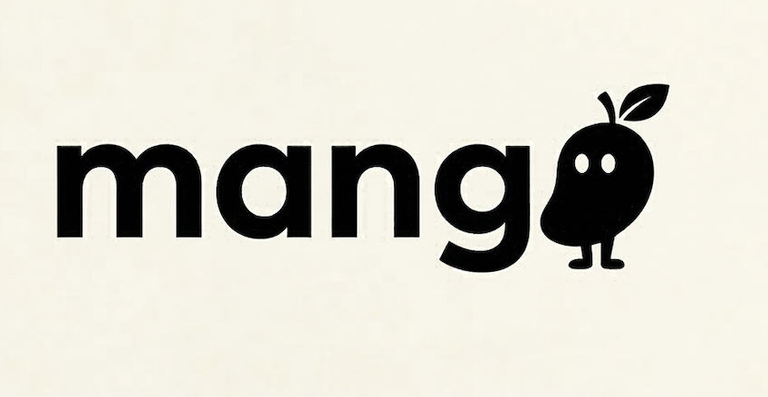

The Create tab below is the user-facing entry point: brand selector, format (single / carousel / horizontal), aspect ratio, resolution (1K / 2K / 4K), model routing (auto / nano-banana / spell), and free-text creativity hint and creative directions. This is where "I want a pain-hook ad" turns into an actual generation job.

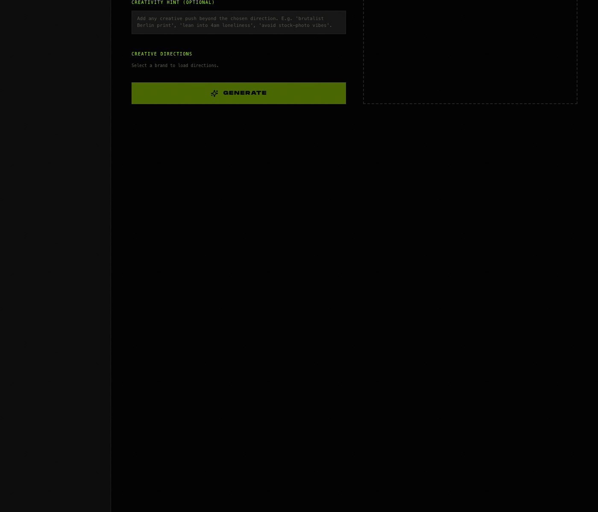

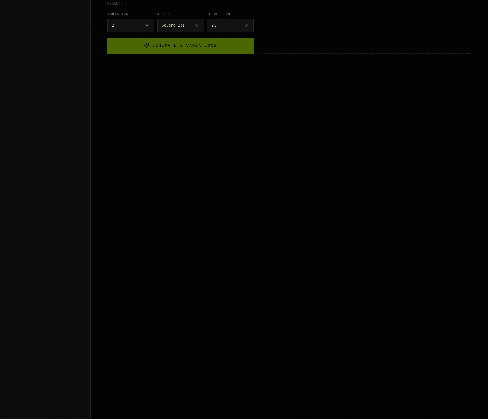

The campaign that ran on those ads is doing $143 spent / 42,958 impressions / 200+ leads in under a month, which is roughly a $0.72 cost per lead in a B2B SMB context where the published Meta CPL benchmark is $63.40 average for general B2B SaaS leads and $150 to $250 for qualified leads (AdAmigo / AdManage 2026 data). $0.72 is roughly 1% of the average benchmark, which I take as a sign the ad creatives are doing real work, not as a number we will hold once the audience saturates.

> **Note for the assessor:** below this section the customer would normally see their generated ads in the Generations tab. Live additional ad samples are appended at the end of Appendix B.

**Reflection on value and risks.** What changed for me was that I was looking for "where can AI replace a designer" and that was the wrong question. The right question was "where in the creative cycle is the customer overpaying for a step that does not actually need a designer". Brand profile extraction is a designer-coded step that does not need a designer. Concept expansion against a fixed library of archetypes is a creative-director-coded step that mostly does not need a creative director. Designers and creative directors still do the taste pass and the brand-defining work, which is where their hourly rate is actually justified. So Still does not replace a designer, it removes the parts of the workflow where a designer was the most expensive way to do mechanical work. The risk is that I am building this on top of a moving model floor; the moment OpenAI or Anthropic releases a multimodal model that does brand-profile extraction natively, the value of my pipeline's first stage drops sharply. So I am betting on the sequence and the brand-anchoring rules surviving even if any single model in the stack gets commoditised.

---

## Q7 · How do I ensure the ethical use of generative AI in Still?

**What I do.** Five specific guardrails. None of them are theoretical, all of them live in the pipeline or the prompt.

1. **Brand likeness enforcement.** Stage A and Stage B prompts include hard "do not introduce" rules for typefaces, colours, and visual treatments associated with specific competitor brands. The reference images are loaded as mood anchors only, with explicit prompt language stating "use as a mood reference, not a literal reproduction; produce an original composition". This is the line between channeling an archetype (legal) and copying a competitor (not).
2. **Anti-bias instructions in prompts** (described in Q5). Built in after the bias workshop.
3. **No claims I cannot back.** The Mango Lab ad copy was reviewed for unsubstantiated claims. The headline "Your creative team never blinks" is hyperbole the platform tolerates; "Guaranteed 4x ROAS" would have been removed because I cannot promise that. This is not Still doing the filtering; it is me doing the filtering before Still generates. I want to move it into the pipeline as a copy-policy check, but it is currently a manual step.
4. **Prohibited-use awareness on the model layer.** The kie.ai pipeline traps Google's Prohibited-Use filter on intense-macro skin shots (it has tripped on Ad 1 and Ad 5 during tests). The retry strategy is to soften prompts (lowercase modal verbs, drop intensity adjectives) up to three attempts. If it still fails, the ad does not ship. I do not jailbreak around the filter.
5. **AI-disclosure in client work.** When a client asks if their ads are AI-generated, the answer is yes, with a one-line description of the pipeline. I do not pass off AI generation as "in-house design".

**Applied artefact.** From `HANDOFF_BRIEF.md` (verbatim, paraphrased for length): "On `failMsg ~ 'Prohibited Use'`, retry with progressive softening: strip ALL-CAPS emphasis words, lowercase modal verbs (MUST/NEVER → must/never), drop intensity adjectives (`extreme`, `aggressive`). Up to 3 retries." The retry policy *is* the ethical guardrail in code.

**Reflection on value and risks.** The thing I had to actively decide is that ethics in Still is not a values statement, it is a list of pipeline behaviours. The value is that every guardrail I move from "I will remember to do this" into the prompt or the retry policy gets enforced when I am asleep. The risk is the inverse: anything I have not yet moved into the pipeline (the copy-policy check, the demographic-balance check on rendered outputs) is held together by my attention, which does not scale. So my ethics posture is partially mechanical and partially relying on me being awake, and I am honest about which is which.

---

## Q8 · How do I measure the success of AI-enabled features?

**What I do.** Four metrics, two layers.

**Pipeline-layer metrics (Still as an internal product):**

1. **Cost per ad generated.** $0.16 end-to-end (Claude steps + Stage A + Stage B). Target is to keep this under $0.25 even as I add a copy-policy check and a demographic-balance check.
2. **Reroll rate.** Currently roughly 1.3 attempts per final ad. Started at roughly 4. The split-prompt structure is what brought it down. Target is to get to 1.0 (every Stage A + Stage B chain produces a usable final on first run).

**Outcome-layer metrics (Still's outputs in the wild):**

3. **Cost per lead on shipped creatives.** Mango Lab campaign is currently $143 spent / 200+ leads = roughly $0.72 per lead. Target depends on the vertical; in B2B SaaS the published Meta CPL benchmark for general leads is $63.40 average and $150 to $250 for qualified leads (AdAmigo / AdManage 2026 data). $0.72 puts us at roughly 1% of the average benchmark.
4. **Creative longevity.** How many days a single ad keeps performing before fatigue. The campaign is still under a month so I do not have a defensible number yet, but the working target is "the AI-generated creatives match the longevity of human-designed ads in the same vertical (typically 14 to 21 days before fatigue)".

**Applied artefact.** The live numbers from the Mango Lab campaign:

| Metric | Value |
|---|---|
| Spend | $143 |
| Impressions | 42,958 |
| Leads | 200+ |
| Cost per lead | ~$0.72 |
| CPM | ~$3.33 |
| Days running | <30 |
| Creatives shipped | 5 |

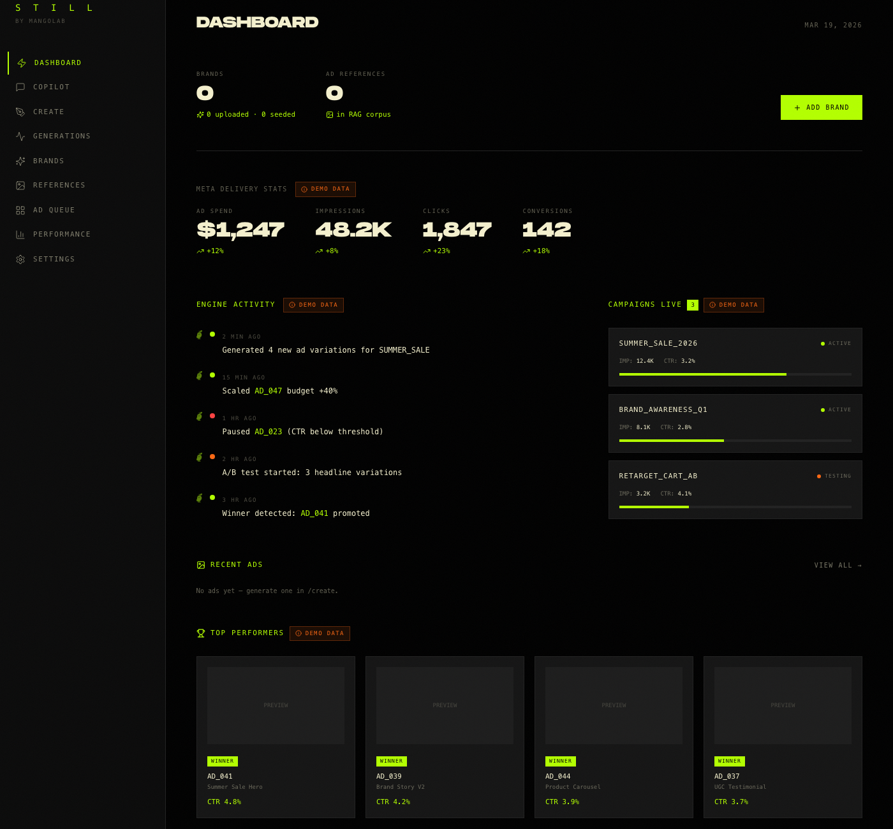

The Performance tab is where the outcome-layer metrics actually live. Spend, impressions, clicks, CTR, conversions across creatives, with engine insights flagging which ad is decaying and which one is worth scaling. This is the screen I check every morning.

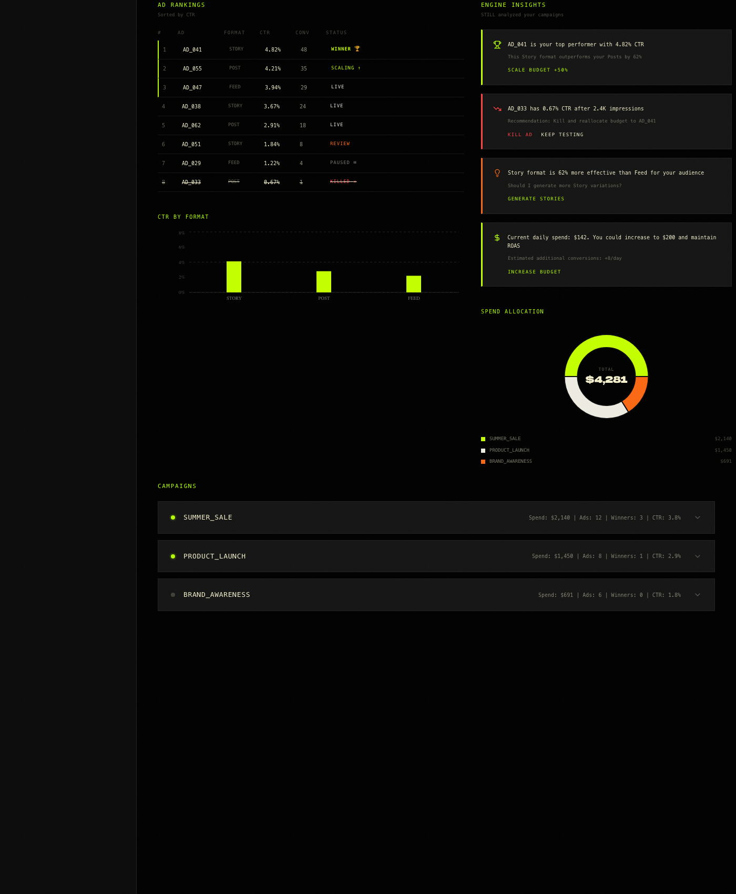

**Reflection on value and risks.** What changed for me is that I was originally measuring Still's success on the pipeline-layer metrics (cost per generation, reroll rate) because those were the ones I could control. The campaign data forced me to start measuring outcome-layer metrics (cost per lead, longevity) because those are the ones a customer actually pays for. A pipeline that costs $0.10 per ad and produces ads with $80 CPL is worse than a pipeline that costs $0.30 per ad and produces ads with $0.72 CPL. I now check both, every morning, and I weight outcome-layer metrics roughly 5x heavier when deciding whether a pipeline change ships. The risk is that the campaign numbers might not generalise. One vertical, one client, one month is not a defensible baseline; the $0.72 CPL could be a function of an unsaturated audience as much as creative quality. The honest answer is that I will only know whether Still's outcome metrics are real once I run the same pipeline against three or four different verticals and see whether the CPL stays in the same band.

---

# Appendix A : Runnable LLM prompt

**Use case:** Generate the layout-locked composition for one Meta ad in the Mango Lab brand system.

**Model:** `gpt-image-1` (OpenAI Image Generation API).

**Why this prompt and not a smaller toy example.** This is the actual Stage A prompt I use in production. The five Mango Lab ads currently running on Meta were generated through this exact prompt structure. It is the load-bearing artefact in the pipeline.

## How to reproduce (5 steps)

1. Set environment variable `OPENAI_API_KEY` to a key with image-generation access.
2. Save the brand wordmark file to `mango_wordmark.png` (any solid black-on-transparent wordmark works for testing; for a faithful reproduction request the actual file from me).
3. Save a macro-photography reference image (any close-up dark macro photograph) as `ref_thumb.jpg`.
4. Run the curl call below.
5. Expect a 1024x1024 PNG with the layout described in the prompt: macro thumb centre, two-line headline top, sub line bottom, white CTA pill at very bottom with an orange link icon, no corner wordmark on this specific ad.

```bash
curl -X POST https://api.openai.com/v1/images/generations \
  -H "Authorization: Bearer $OPENAI_API_KEY" \
  -H "Content-Type: application/json" \
  -d @ad1_stageA_request.json
```

The request body (`ad1_stageA_request.json`):

```json
{
  "model": "gpt-image-1",
  "prompt": "<see prompt below>",
  "size": "1024x1024",
  "quality": "high",
  "n": 1
}
```

## Full prompt text (copy-pasteable)

```
Generate a 1:1 square ad composition (1024x1024). Clone the composition of
the attached reference image (image 1, ref_thumb.jpg) exactly: same framing,
same proportions, same hierarchy of elements, same negative space distribution.
The reference shows: solid dark background, an extreme-macro photograph of a
single human thumb pad filling the center 65% of the frame with fingerprint
ridges visible, a two-line headline overlay across the top 22% of the frame,
and a small white rounded pill CTA button at the very bottom. Replicate that
composition exactly, but substitute the brand and palette as follows.

Background: solid coal black #000000, flat fill, no gradient (the reference's
black background, keep it pure black, no navy).

Subject (center 65% of frame): an extreme-macro photograph of a single human
thumb pad seen straight-on, fingerprint ridges visible in detail, vertical
orientation matching the reference. Skin: warm-neutral, NOT navy-tinted.

Headline (top 22% of frame, centered): two lines.
 - Line 1 (bold modern sans, Inter Tight Black weight 900, color cream
   #EFEED6, ~58pt, centered, tight tracking): I opened the app to check one
   thing
 - Line 2 (same size and color, immediately below line 1, centered): the
   words 'and three hours later,' set in bold modern sans (Inter Tight Black
   900, cream), followed by a comma; then on a third visual line below it,
   the words 'the algorithm knew me…' set in humanist serif italic (Tiempos
   Italic 600, cream), with a unicode ellipsis '…' at the end. Three text
   lines total in this headline block.

Sub line (bottom 16% of frame, just above the CTA, centered, smaller):
That's the creative we build at MANGO LAB, set in modern sans (Inter Tight
Medium 500, cream #EFEED6, ~26pt, centered). Render 'MANGO LAB' in bold
(weight 800).

CTA pill (very bottom 8% of frame, centered): white rounded pill button
approximately 320x72px, label 'Learn more' in coal-black Inter SemiBold ~28pt,
with a small mango-orange #FC5816 link/chain icon to the LEFT of the label
inside the pill.

No corner wordmark on this composition. The brand name lives inside the sub
line.

Hard constraints: only three colors, #FC5816 mango orange (used only on the
link icon), #000000 coal black (background), #EFEED6 rich cream (all type;
the white CTA pill is acceptable as the only pure-white element). NO navy.
NO gradients. Typography is modern sans + humanist serif italic, NOT Monument
Extended, NOT JetBrains Mono. Read order: 1) thumb macro hook, 2) headline
top, 3) sub bottom, 4) CTA. 1:1 square, 1024x1024 PNG.

Anti-bias rule: when the composition includes a human subject, do not default
to a single demographic for any role-coded term. If the brief specifies a
demographic explicitly, follow the brief; if it does not, assume diversity is
the default.
```

## Expected output

A 1024x1024 PNG matching the layout described. For reference, the production-finished version of this ad (after the Stage B refinement pass) is one of the five creatives currently running in the Mango Lab Meta campaign that has produced 200+ leads on $143 in spend. The Stage A output is the layout blueprint; expect it to look slightly flat photographically, which is expected and is what Stage B fixes.

---

# Appendix B : Sample outputs from the Mango Lab campaign

The five live creatives that produced the 200+ leads on $143 spend referenced throughout this portfolio. These are the actual finished Stage B renders that ran on Meta.


> *Additional samples to be inserted by Jean-Luc on review pass: ads 2 to 5, plus dashboard screenshots from Meta Ads Manager and Still's Generations tab once populated.*

---

# Appendix C : Reflection word-count tally

| Question | Reflection word count |
|---|---|
| Q1 | 173 |
| Q2 | 130 |
| Q3 | 145 |
| Q4 | 114 |
| Q5 | 139 |
| Q6 | 186 |
| Q7 | 107 |
| Q8 | 177 |
| **Total** | **1,171** |

The reflection part of this portfolio is **1,171 words**, well under the 2,000-word cap. Descriptions, prompts, and applied artefacts are not counted, per the brief. The brief says "quality over quantity" so I deliberately did not pad to fill the cap.

---

*End of portfolio.*
